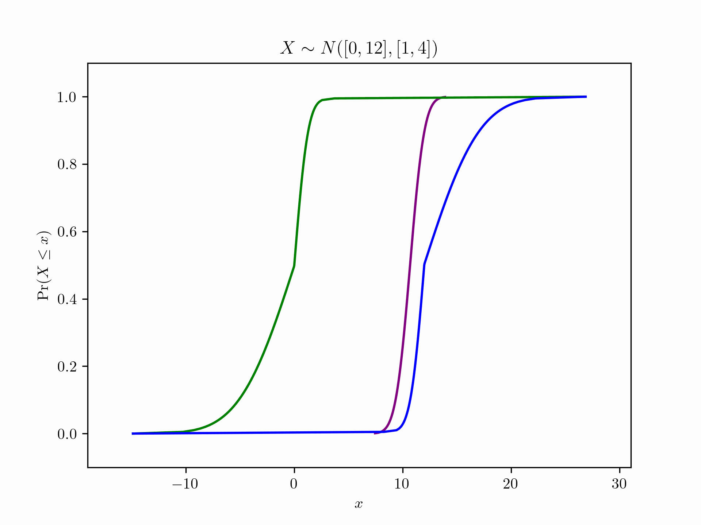

# PyUncertainNumber

--------
<!-- some banners -->

<!-- <a target="_blank" href="https://cookiecutter-data-science.drivendata.org/">
    
</a> -->

**Uncertain Number** refers to a class of mathematical objects useful for risk analysis that generalize real numbers, intervals, probability distributions, interval bounds on probability distributions (i.e. [probability boxes](https://en.wikipedia.org/wiki/Probability_box)), and finite DempsterShafer structures.

## Usage

`PyUncertainNumber` can be used to easily create a `PBox` or an `Interval` object:

```python
from PyUncertainNumber import UncertainNumber as UN

un = UN(
    name='elas_modulus', 
    symbol='E', 
    units='Pa', 
    essence='pbox', 
    distribution_parameters=['gaussian', [(0,12),(1,4)]])
_ = un.display(style='band')
```

<!-- add some pbox plots herein -->


## Installation of the development version

```bash
pip install -e .
```

<!-- ## Contributing

Interested in contributing? Check out the contributing guidelines. 
Please note that this project is released with a Code of Conduct. 
By contributing to this project, you agree to abide by its terms. -->

<!-- ## License

`PyUncertainNumber` was created by Yu Chen (Leslie). It is licensed under the terms
of the MIT license. -->
