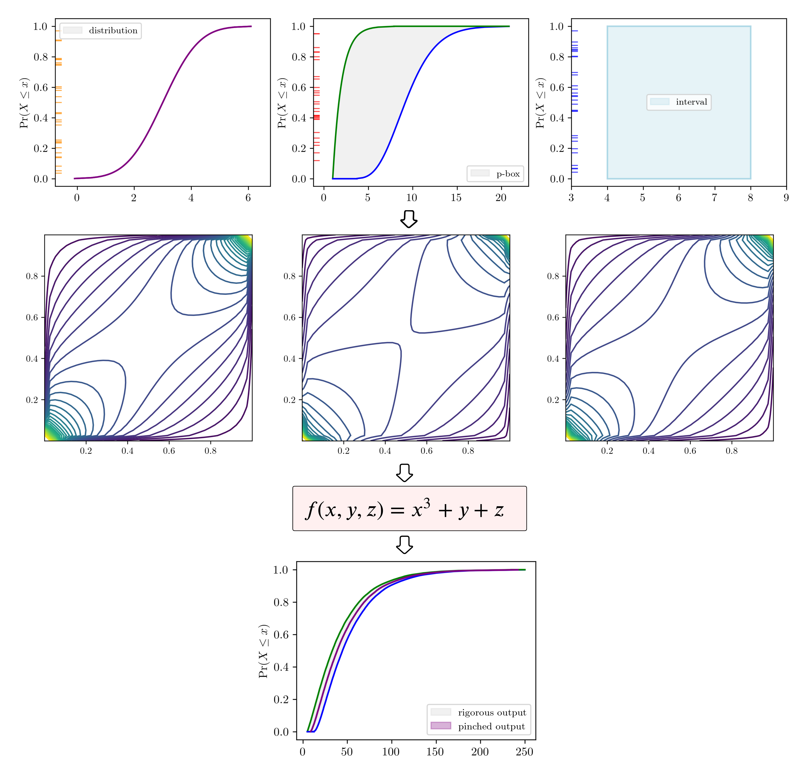

# Summary

Scientific computations or simulations play a central role in quantifying the performance, reliability, and safety of complex engineered systems. However, these analyses are complicated by the various sources of uncertainties inherent in the computational pipeline. Underestimation may lead to suboptimal performance outside the most common scenarios while overestimation, on the other hand, may lead to over-engineered systems and significant waste of resources. To ensure that complex engineered systems can be operated reliably and robustly, even during rare and extreme environment conditions, a comprehensive analysis is required. The analysis should be comprehensive in two senses: (i) all of the possible sources of uncertainty must be identified and represented using approaite mathematical construct; (ii) that rigorously account for mixed or mixture of various types of uncertainties. Challenges include xxx, code accessbility, tools to conduct the analysis.
By xxx, `pyuncertainnumber` bla bla.. non-intrusively.

<!-- To quantitatively
account for uncertainty is vital in performance, relibiability, and safety of high-consequence systems. However, the challenge xxx of . More expressive frameworks are proposed to manage uncertainties in an imprecise setting. It is desired to  -->

# Statement of need

A comprehensive uncertainty framework for scientific computation involves a mathematical model,
through which various input uncertainties are propagated to estimate the uncertainty of an unknown quantity of interest.
In real-world applications, these input uncertainties are commonly manifested as mixed uncertainties, e.g. probability boxes (p-boxes) which effectively represents a set of distributionbs, combining both the aleatory and epistemic uncertainty in one structure, or a mixture of uncertainties suggesting, for instance, a vector of inputs parameters of aleatory (e.g. probability distributions), epistemic (e.g. intervals), and mixed nature (e.g. probability boxes).

Probability bounds analysis is one of the expressive frameworks proposed to manage uncertainties in an imprecise setting.
Packages have been developed to facilitate the calculations of uncertain quantities, such as interval arithmetic [@marco_2022_6205624] and probability arithemetic [@gray:2021; @gray:2022]. Collectively, they can be referred to as *uncertainty arithmetic* which straightforwardly computes the response provided the performance function.

While it has the potential to automatically compile non-deterministic subroutines via uncertain primitives, its usages face several challenges.
Besides the known issues such as [dependency problems](https://pyuncertainnumber.readthedocs.io/en/latest/examples/repeated_variable.html), one significant challenge is that code accessibility is often not guaranteed and hence unable to proceed. This would largely restrict the adoption of mixed uncertainty calculations in engineering practice.

`pyuncertainnumber` addresses that by enabling non-intrusive capability. That is, generic black-box models can be propagated with (that fancy word) various types of uncertainty.
This capability significantly boost its versatility for scientific computations by interfacing with many engineering softwares.

# Interval propagation in a non-intrusive manner

Interval analysis has the advantages of providing rigorous enclosures of the solutions to problems, especially for engineering problems
subject to epistemic uncertainty, such as modelling system paramters due to lack-of-knowledge or characterising measurement incertitude.
It is evident that computational tasks requiring complex numerical solutions of intervals are non-intrusive (i.e. the source code is not accessiable).
Besides, it shoule be noted even for cystal boxes (i.e. source code is accessible), naive interval arithmetic still faces challlenges such as the infamous interval dependency issue. 
Though it may be mitigated through mathematical rearrangements in some cases, it will be challenging for most of the cases.
<!-- But naive interval arithmetic faces xxx problems, though xxx provides mathematical re-arrangements.  -->

Generally, the interval propagation problem can be cast as an optimisation problem where the minimum and maximum are sought via a function mapping.
The functio, for example $g$ in Eq.(xx), is not necessarily monotonic or linear and may well be a black-box model. Hence, for black box models the optimisation can 
only be solved via gradient-free optimisation techniques.

\begin{equation}
Y = g(I_{x1}, I_{x2}, ..., I_{xn})
\end{equation}

\begin{equation}
Y_min, Y_max
\end{equation}

where $I_{x1}, I_{x2}, ..., I_{xn}$ are intervals.

`pyuncertainnumber` provides a series of non-intrusive methodologies of varying applicability. It should be noted that there is generally a trade-off between 
applicability and efficiency. But with more knowledge about the characteristics of the underlying function, one can accordinly dispatch an efficient method.
For example, whem monotonicity is known one can use vertex methods which $2_n$.

<!-- tabulate the interval results from the example -->
<!-- think twice. the middle row can be changed into a paragraph in the main text instead -->

Table: Several methods for interval propagation []{label='ip_methods'}

| Method     | Endpoints    | Subinterval reconstitution | Cauthy-Deviate method           | Bayesian optimisation | Genetic algorithm |
|------------|--------------|----------------------------|---------------------------------|-----------------------|-------------------|
| Assumption | monotonicity | heavy computation          | linearity and gradient required | No                    | No                |
| Result     |              |                            |                                 |                       |                   |

As shown in \autoref{ip_methods}, tabulation of xxx given a black box model.
<!-- show the figure to indicate the ground-truth answer -->

# Mixed uncertainty propagation for black-box models

Mixed uncertainty problem is the most realistic situation bla bla. It first requires faithful characterisation of uncertainty given the empirical information, and the approaach to rigorously progate them.
Imprecise world bla bla. After faithful characterisation, the ability to propagate is the key in many critical engineering applications. 

\begin{equation}
Y = f(\mathbf{u}; C)
\end{equation}

<!-- see the pbox propagation paper (iMC) and copy some texts herein -->

Dependency structures bla bla. It has been echoed in the engineering applications and also the NASA challenge.

Sampling methods play a significant role in xxx

Double Monte Carlo

Interval Monte Carlo...

Figures can be included like this:

\autoref{fig:dmc} illustrates the *nested Monte Carlo* method.

\autoref{fig:imc} illustrates the *interval Monte Carlo* method.

<!-- Figure sizes can be customized by adding an optional second parameter:
{ width=20% } -->

# Conclusion

<!-- reiterate the significance of our developments  !!! -->
`pyuncertainnumber` enables rigorous uncertainty analysis for real-world situations 
of mixed uncertainties and partial knowledge. 
Significance: this provides compatability as interfacing with many engineering applications.
boost its usage.

<!-- # Propagation of p-boxes via surrogate models -->

# Acknowledgements

The work leading to these results received funding through the UK project Development of Advanced Wing Solutions 2 (DAWS2). The DAWS2 project is supported by the Aerospace Technology Institute (ATI) Programme, a joint government and industry investment to maintain and grow the UK’s competitive position in civil aerospace design and manufacture. The programme, delivered through a partnership between ATI, Department for Business and Trade (DBT) and Innovate UK, addresses technology, capability and supply chain challenges.

# References