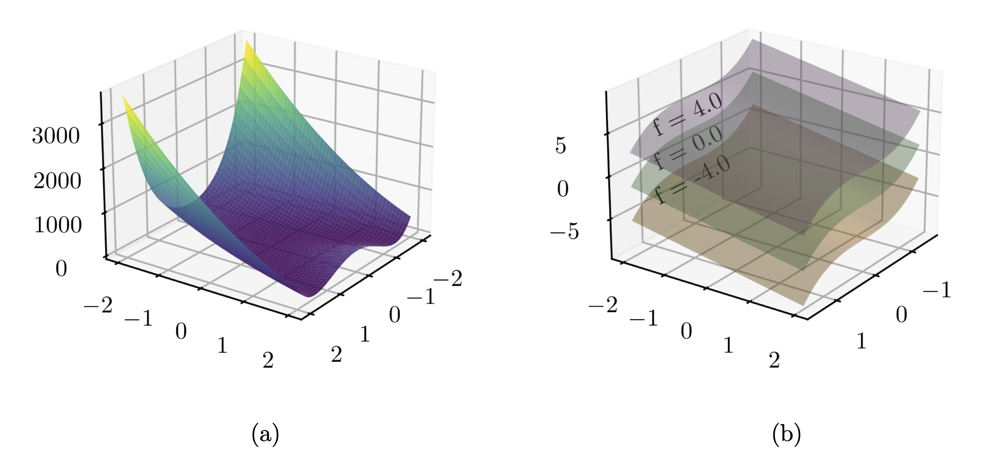
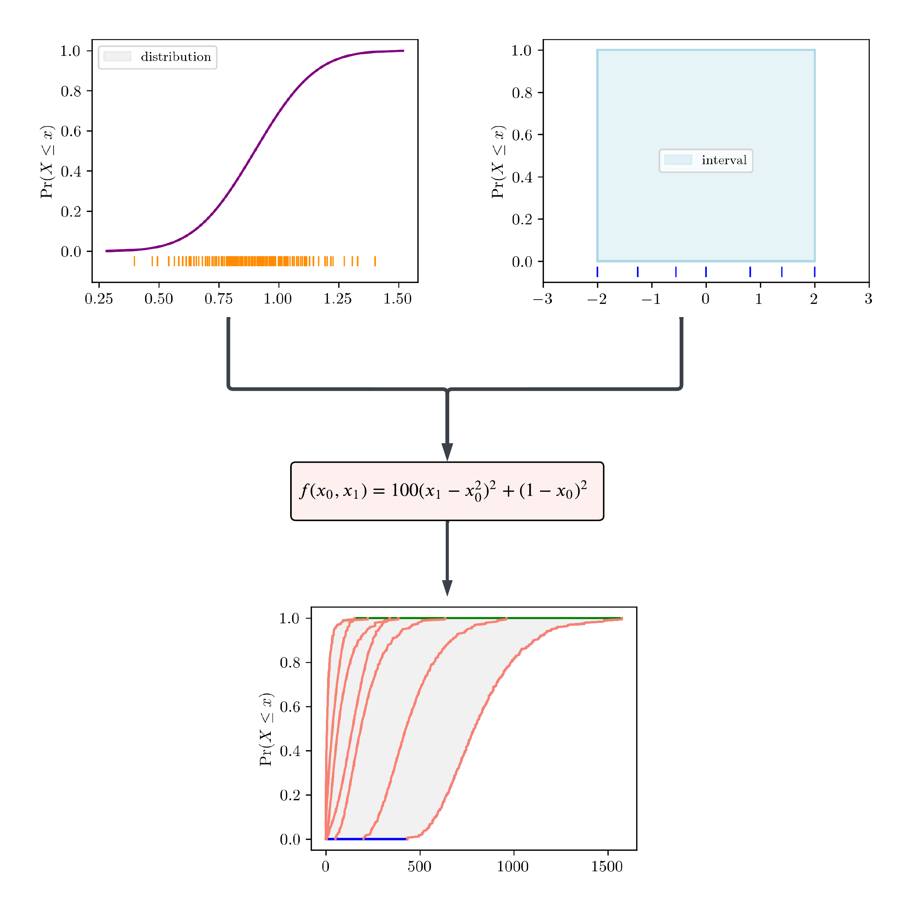
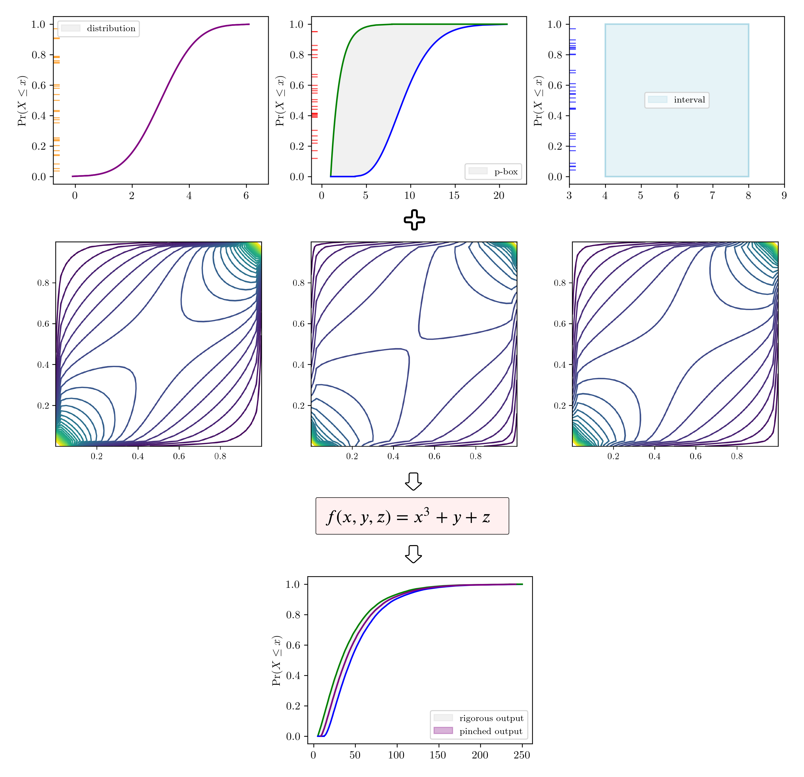

<!-- another title -->
<!-- title: 'PyUncertainNumber for uncertainty propagation: beyond probabilistic arithmetic' -->

# Summary

Scientific calculations and simulations are complicated by various uncertainties inherent in the computational pipeline. Comprehensive analysis requires uncertainties be represented using mathematical constructs that distinguish variability from lack of knowledge and combine them rigorously in calculations. The new Python library `pyuncertainnumber` enables such analysis by computing guaranteed bounds on functions of uncertain variables given only partial empirical knowledge. It supports both intrusive methods that are efficient for projection through explicitly defined mathematical models and non-intrusive methods that can be used with black-box models that associate outputs with given inputs but whose internal workings are not known. 

<!-- given only partial knowledge of the input probability distributions and their dependencies. -->

<!-- Critical challenges include xxx, code accessbility, tools to conduct the analysis. -->
<!-- By xxx, `pyuncertainnumber` bla bla.. non-intrusively. -->

<!-- Challenges include xxx, code accessbility, tools to conduct the analysis. -->

<!-- To quantitatively
account for uncertainty is vital in performance, relibiability, and safety of high-consequence systems. However, the challenge xxx of . More expressive frameworks are proposed to manage uncertainties in an imprecise setting. It is desired to  -->

# Statement of need

A comprehensive uncertainty framework for scientific computation involves a mathematical model,
through which various input uncertainties are propagated to estimate the uncertainty of an unknown quantity of interest (QoI).
Real-world complex systems (physical or engineered) of industrial significance typically involves input parameters subject to uncertainties of various nature [@oberkampf:2004; @smith:2004]. These input uncertainties often appear as a mixture of parameters subject to variability (i.e. aleatory uncertainty, typically represented by probability distributions), or lack of knowledge (i.e. epistemic uncertainty, often represented by intervals), or a combination of both (i.e. mixed uncertainty, often represented by probability boxes (p-boxes)), which effectively represent a set of distributions and thereby capture both aleatory and epistemic uncertainty within a unified structure.

Probability bounds analysis [@springer1979algebra; @williamson1990probabilistic; @ferson:2001] is one of the expressive frameworks proposed to manage uncertainties in an imprecise setting [@beer:2013].
Software packages have been developed to facilitate the calculations of uncertain quantities, such as *interval arithmetic* [@marco_2022_6205624] and *probabilistic arithmetic* [@gray:2021; @gray:2022]. Collectively, they can be referred to as *uncertainty arithmetic* [@chen:2025], which provides a straightforward way to compute outcomes from algebraic expressions involving uncertain variables.

While these uncertainty-representing frameworks have the potential to automatically compile non-deterministic subroutines via uncertain primitives, their use faces several challenges. A major one is that code accessibility[^1] of the simulation models or software (e.g. finite-element or computational-fluid-dynamics models) employed to describe the behavior of the system is often not guaranteed, rendering intrusive[^2] use of the above-mentioned uncertainty-representing frameworks infeasible. Often, these models are treated as black-box models in practice.
Consequently, there is a critical need for software tools capable of performing mixed-uncertainty calculations on black-box models in real-world applications of computational engineering and physics.

<!-- This would largely restrict the adoption of these tools  -->

<!-- Such need has been echoed in the engineering applications and also the NASA challenge. -->

<!-- besides known issues such as [dependency problems](https://pyuncertainnumber.readthedocs.io/en/latest/examples/repeated_variable.html) -->

`pyuncertainnumber` addresses this need by providing the non-intrusive[^3] capability designed to allow generic black-box models to be rigorously propagated in the face of mixed uncertainties.
This capability significantly boosts versatility for scientific computations through interfacing with many engineering software whose internal workings are not known.

# Interval propagation in a non-intrusive manner

Interval analysis [@moore:2009] features the advantages of providing rigorous enclosures of the solutions to problems, especially for engineering problems
subject to epistemic uncertainty, such as modelling system parameters due to lack-of-knowledge or characterising measurement incertitude.
Naive interval arithmetic typically faces difficulties such as the infamous [interval dependency](https://pyuncertainnumber.readthedocs.io/en/latest/examples/repeated_variable.html) issue. 
Though it may be mitigated through arithmetic rearrangements in some simple cases, it still can be challenging for models of most complex systems, and impossible for black-box models.
The critical issue remains the accessibility of code.

<!-- But naive interval arithmetic faces xxx problems, though xxx provides mathematical re-arrangements.  -->

Generally, the interval propagation problem can be cast as an optimisation problem where the minimum and maximum of the response are sought given a function mapping.
Consider the function, for example $f$ in \autoref{eq:intervalpropagation}, which is not necessarily monotonic or linear and may well be a black-box deterministic model for a generic system. 

\begin{equation}\label{eq:intervalpropagation}
Y = f(I_{x1}, I_{x2}, ..., I_{xn})
\end{equation}

where $\mathbf{I} = [\mathbf{\underline{I}}, \mathbf{\overline{I}}] = [I_{x1}, I_{x2}, ..., I_{xn}]^\text{T}$ represents the vector of interval-valued inputs.
For black-box models the optimisation can generally be solved via gradient-free optimisation techniques, as shown below:

$$\underline{Y} = \min_{\underline{\mathbf{I}} \leq \mathbf{I} \leq \overline{\mathbf{I}} } [f(\mathbf{I})]; \ \overline{Y} = \max_{\underline{\mathbf{I}} \leq \mathbf{I} \leq \overline{\mathbf{I}} } [f(\mathbf{I})]$$

`pyuncertainnumber` provides a series of non-intrusive methodologies of varying applicability. It should be noted that there is generally a trade-off between 
applicability and computational efficiency. With additional knowledge pertaining the characteristics of the underlying function, one can accordinly dispatch an efficient method.
For example, if the function is known to be monotone,  one may employ the vertex method [@dong1987vertex] which requres only $2^n$ model evaluations and is therefore subtantially more efficient than a brute-force grid sampling scheme. It should be noted that the accuracy of these methods varies, and a common guideline is that increasing the number of model evaluations generally leads to a better estimate of the bound but at the cost of compututational burden.
A summary of applicability is tabulated in \autoref{tab:ipmethods}; see @chen:2025 for additional details of their advantages and disadvantages.

<!-- Table: Several methods for interval propagation []{label="tab:ipmethods"} -->
Table: Supported methods for non-intrusive interval propagation.\label{tab:ipmethods}

| Category        | Assumption                         | Results of Example A   |
|-----------------|------------------------------------|------------------|
| Vertex (Endpoints) | monotonicity                        | [13.0,148.0]     |
| Subinterval reconstitution | monotonicity in subintervals     | [13.0,148.0]     |
| Cauchy-deviate method | linearity and gradient required     | [-11.7,100.67]   |
| Bayesian optimisation | general applicability                                 | [13.0,148.0]     |
| Genetic algorithm     | general applicability                                 | [13.0,147.8]     |

To better demonstrate the non-intrusive capability, two numerical examples, as displayed below in \autoref{fig:two_functions}, are provided where they are treated as black-box models. 
\autoref{tab:ipmethods} lists the response interval of $f_{a}([1,5], [7,13], [5,10])$ for respective methods. A reference ground truth is $[13.0, 148.0]$.

# Mixed uncertainty propagation for black-box models

Real world complex systems (physical or engineered) of industrial significance typically involves parameters subject to uncertainties of various nature [@oberkampf:2004]. It requires faithful characterisation of these uncertainties given the empirical information, and the approaach to rigorously progate them. Due to the fact that empirical information is often sparse or scarce or conflicting, even the uncertainty characterisation for one parameter could be of mixed nature, for example one may be confident about the distributional family but uncertain about its shape parameters, or when there exists multiple expert opiontion of different credibility regarding its elicitation. 
Commonly, real systems expect a high-dimensional input which effectively represents a mixture of aleatory, epistemic, and mixed uncertainties, as symbolfied below:

<!-- Imprecise world bla bla. After faithful characterisation, the ability to propagate is the key in many critical engineering applications.  -->

\begin{equation}
Y = f(\mathbf{u}; C)
\end{equation}

where $\mathbf{u} \in \mathbb{R}^{n}$ denotes the collection of $n$ uncertain inputs and $C$ denotes intervariable dependency structure.

When both aleatory and epistemic uncertainties are present in $\mathbf{u}$, a *nested (double) Monte Carlo* approach can be used for determininsitc models without confounding the two distinct types of uncertainty.
As illustrated in \autoref{fig:dmc} with the examplar function B (see \autoref{fig:two_functions}), Latin-hypercube samples are first drawn from the epistemic interval, conditioned on which aleatory samples are drawn from the aleatoric probability distributions. 
Propagate these samples, which are visually denoted as rug ticks alongside the abscissa, through the computational model results in an ensemble of CDF (cumulative distribution function) of the QoI whereby a final p-box is obtained as the envelope. 
Each CDF (orange color) correponds to an epistemic sample. 

To scale to a more realistic setting, \autoref{fig:imc} illustrates the workflow of *interval Monte Carlo* method using the examplar function A where a mixture of aleatory, epistemic, and mixed uncertainty parameters are present, plus a certain copula is specified denoting the dependency structure. Correlated samples in the uniform space from the copula, visually denoted as rug ticks alongside the probability axis, are converted to physical space through alpha-cuts. Interval propagation (see [the last section](#interval-propagation-in-a-non-intrusive-manner)) then does the heavy lifting in which scalar values can be considered as degenerate intervals. As a result, the response QoI in \autoref{fig:imc} is then obtained as a p-box shown in gray. In contrast, a pinched response, obtained from propagating pinched input variables (e.g. a p-box is pinched into a distribution and an interval is pinched into a scalar), is also shown as a comparison. Importantly, the pinched result being enclosed  in the p-box manifests a critical feature of probability bounds analysis which yields results that are guaranteed to encolse all possible distributions of the ouput so long as the input p-boxes were all sure to enclose their respective distributions.

# Conclusion

<!-- reiterate the significance of our developments  !!! -->

It is evident that many computational tasks in engineering and physics rely on complex numerical methods in which the model functions are black boxes.
This makes uncertainty arithmetic difficult to manage because the model code is inaccessible.
By providing methods supporting generic black-box models, `pyuncertainnumber` enables rigorous uncertainty analysis for real-world scenarios of mixed uncertainties and partial knowledge.
This non-intrusive capability allows `pyuncertainnumber` to interface with multiple software environments, offering extensive compatibility with engineering applications and diverse computational workflows.
<!-- We interface with many softwares.
Significance: this provides compatability as interfacing with many engineering applications.
boost its usage.

Enriched sampling methods bla bla ... -->
<!-- # Propagation of p-boxes via surrogate models -->

# Acknowledgements

The work leading to these results received funding through the UK project Development of Advanced Wing Solutions 2 (DAWS2). The DAWS2 project is supported by the Aerospace Technology Institute (ATI) Programme, a joint government and industry investment to maintain and grow the UK’s competitive position in civil aerospace design and manufacture. The programme, delivered through a partnership between ATI, Department for Business and Trade (DBT) and Innovate UK, addresses technology, capability and supply chain challenges.

# References

[^1]: access to the source code.
[^2]: requiring access or modification of the source code of a computational model.
[^3]: operating on the model as a black box, without accessing or modifying its internals.